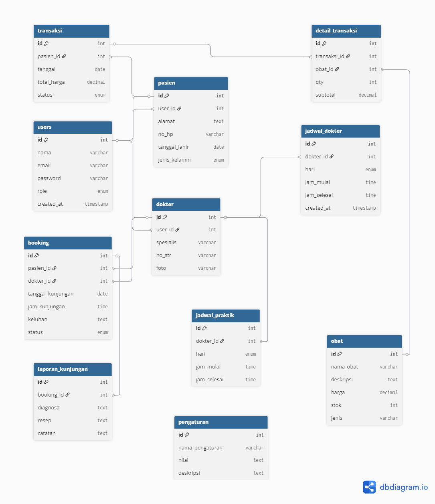

# 🏥✨ Klinik Alma Sehat - Your Health, Our Priority ✨🏥

<div align="center">
  
  
  [](https://php.net)
  [](https://mysql.com)
  [](https://getbootstrap.com)
  [](https://sttbontang.ac.id)
  
  **💖 Sistem Manajemen Klinik Modern & User-Friendly 💖**
  
  *Platform klinik terpercaya dengan layanan konsultasi online dan apotek digital*
</div>

---

## 🌸 **Meet the Developer** 🌸

<div align="center">
  <table>
    <tr>
      <td align="center">👩‍💻</td>
      <td><strong>Nama</strong></td>
      <td>Alma Inna</td>
    </tr>
    <tr>
      <td align="center">🎓</td>
      <td><strong>NIM</strong></td>
      <td>202312057</td>
    </tr>
    <tr>
      <td align="center">💌</td>
      <td><strong>Email</strong></td>
      <td>flowerrdaaisy@gmail.com</td>
    </tr>
    <tr>
      <td align="center">🏫</td>
      <td><strong>Program Studi</strong></td>
      <td>Teknik Informatika</td>
    </tr>
    <tr>
      <td align="center">🏛️</td>
      <td><strong>Institusi</strong></td>
      <td>Sekolah Tinggi Teknologi Bontang</td>
    </tr>
    <tr>
      <td align="center">📚</td>
      <td><strong>Proyek</strong></td>
      <td>Ujian Akhir Semester - Pemrograman Web</td>
    </tr>
  </table>
</div>

---

## 🌐 **Demo & Live Preview**

<div align="center">
  <table>
    <tr>
      <td align="center">
        <a href="#" target="_blank">
          <br/>
          <b>🎥 Video Demo</b><br/>
          <sub>YouTube Presentation</sub>
        </a>
      </td>
      <td align="center">
        <a href="#" target="_blank">
          <br/>
          <b>🌠Live Demo</b><br/>
          <sub>Hosted Application</sub>
        </a>
      </td>
    </tr>
    <tr>
      <td align="center">
        <a href="#" target="_blank">
          
        </a>
      </td>
      <td align="center">
        <a href="#" target="_blank">
          
        </a>
      </td>
    </tr>
  </table>
</div>

> 📝 **Catatan:** Ganti link `#` di atas dengan URL YouTube dan hosting yang sebenarnya

### 🎬 **Video Demonstration**
- **YouTube Link:** [https://youtu.be/7gMtDW2jmI0?si=5eK37iwq8cRk3_7x](#) 
- **Duration:** ~10-15 menit
- **Content:** Penjelasan fitur, demo penggunaan, dan code walkthrough

### 🌍 **Live Application**
- **Hosting URL:** [https://alma.mangaverse.my.id/](#)
- **Test Accounts:** Gunakan akun demo yang tersedia
- **Status:** ✅ Online 24/7

---

## 📚 **Dokumentasi Lengkap**

Untuk informasi lebih detail tentang proyek ini, silakan kunjungi dokumentasi lengkap berikut:

<div align="center">
  <table>
    <tr>
      <td align="center">
        <a href="docs/DATABASE.md">
          <br/>
          <b>🗄️ Database</b><br/>
          <sub>Schema & Structure</sub>
        </a>
      </td>
      <td align="center">
        <a href="docs/INSTALLATION.md">
          <br/>
          <b>🔧 Installation</b><br/>
          <sub>Setup Guide</sub>
        </a>
      </td>
      <td align="center">
        <a href="docs/DEPLOYMENT.md">
          <br/>
          <b>🚀 Deployment</b><br/>
          <sub>Production Guide</sub>
        </a>
      </td>
      <td align="center">
        <a href="docs/USAGE.md">
          <br/>
          <b>📖 Usage</b><br/>
          <sub>User Manual</sub>
        </a>
      </td>
    </tr>
  </table>
</div>

### 📋 **Quick Navigation**
- [👩‍💻 Developer Info](#-meet-the-developer-) | [🎬 Demo & Preview](#-demo--live-preview) | [✨ Fitur](#-fitur-utama) | [🏗️ Arsitektur](#️-arsitektur-sistem)
- [📁 Struktur](#-struktur-direktori) | [🚀 Instalasi](#-quick-start-guide) | [🖥️ Usage](#️-cara-penggunaan) | [🔒 Security](#-sistem-keamanan)
- [🎨 Design](#-design-system--ui) | [🐛 Issues](#-troubleshooting) | [📞 Support](#-support--contact) | [📄 License](#-license)

---

## 🌟 **Fitur Utama**

### 👥 **Untuk Pasien**
- **🔐 Registrasi & Login** - Daftar akun baru dan login dengan keamanan tinggi
- **📅 Booking Konsultasi** - Reservasi jadwal dengan dokter favorit
- **💊 Apotek Online** - Beli obat dengan sistem keranjang belanja yang mudah
- **📋 Riwayat Konsultasi** - Lihat riwayat booking dan hasil konsultasi
- **📊 Riwayat Pembelian** - Lihat riwayat transaksi obat lengkap
- **👤 Profil Management** - Edit data profil pribadi dengan mudah

### 👨‍⚕️ **Untuk Dokter**
- **📈 Dashboard Dokter** - Lihat jadwal dan pasien dalam satu tempat
- **⏰ Manajemen Jadwal** - Atur jadwal praktik dengan fleksibel
- **👩‍⚕️ Konsultasi Pasien** - Lihat daftar pasien yang booking
- **📝 Laporan Kunjungan** - Input diagnosa dan resep secara digital

### 👨‍💼 **Untuk Admin**
- **📊 Dashboard Admin** - Statistik dan overview sistem real-time
- **👥 Manajemen User** - CRUD data admin, dokter, dan pasien
- **👨‍⚕️ Manajemen Dokter** - CRUD data dokter dan jadwal praktik
- **💊 Manajemen Obat** - CRUD data obat dan stok inventory
- **📅 Manajemen Booking** - Kelola booking konsultasi dengan efisien
- **💰 Manajemen Transaksi** - Kelola transaksi penjualan obat
- **📈 Laporan** - Laporan penjualan, kunjungan, dan aktivitas
- **⚙️ Pengaturan Sistem** - Konfigurasi info klinik dan sistem

---

## 🏗️ **Arsitektur Sistem**

### **Tech Stack**
- **Backend**: PHP 7.4+ dengan PDO (Native)
- **Database**: MySQL 5.7+ / MariaDB 10.5+
- **Frontend**: Bootstrap 5.3, HTML5, CSS3, JavaScript
- **Authentication**: Session-based dengan password hashing
- **Icons**: Bootstrap Icons & Font Awesome
- **Security**: Prepared statements, input validation, XSS protection

### **Struktur Database**

<div align="center">
  
  <p><em>🎯 Entity Relationship Diagram - Klinik Alma Sehat</em></p>
  <p><sub>Klik <a href="docs/DATABASE.md">di sini</a> untuk dokumentasi database lengkap</sub></p>
</div>

```
📊 Database: klinik_alma
├── users (👥 Data pengguna & admin)
├── doctors (👨‍⚕️ Data dokter dan spesialisasi)
├── patients (👩‍🦾 Data pasien)
├── schedules (📅 Jadwal praktik dokter)
├── bookings (📆 Data booking konsultasi)
├── medicines (💊 Data obat dan stok)
├── transactions (💰 Data transaksi penjualan)
├── transaction_details (📄 Detail item transaksi)
└── logs (📁 Audit trail)
```

## 📋 Persyaratan Sistem

- PHP 7.4 atau lebih tinggi
- MySQL 5.7 atau lebih tinggi
- Apache Web Server
- Browser modern (Chrome, Firefox, Safari, Edge)

## 🔧 Instalasi

### 1. Clone atau Download Project
```bash
git clone [repository-url]
# atau download dan extract ke folder xampp/htdocs/alma
```

### 2. Setup Database
1. Buka phpMyAdmin (http://localhost/phpmyadmin)
2. Import file `database/klinik_alma.sql`
3. Database `klinik_alma` akan terbuat otomatis dengan data sample

### 3. Konfigurasi Database
Edit file `config/database.php` jika diperlukan:
```php
define('DB_HOST', 'localhost');
define('DB_USER', 'root');
define('DB_PASS', '');
define('DB_NAME', 'klinik_alma');
```

### 4. Setup Folder Upload
Buat folder untuk upload file:
```
mkdir uploads
mkdir uploads/doctors
chmod 755 uploads
chmod 755 uploads/doctors
```

### 5. Test Database Connection
Akses: `http://localhost/alma/test_db.php`
- Untuk memverifikasi koneksi database
- Memeriksa status semua tabel
- Melihat data sample yang tersedia

### 6. Quick Setup (Windows)
Jalankan file `setup.bat` untuk panduan lengkap

### 7. Akses Aplikasi
Buka browser dan akses: `http://localhost/alma`

## 👤 Akun Default

### Admin
- **Email**: admin@klinik.com
- **Password**: password

### Dokter
- **Email**: ahmad@klinik.com
- **Password**: password
- **Email**: sari@klinik.com
- **Password**: password

### Pasien
Daftar akun baru melalui halaman registrasi

---

## 📁 **Struktur Direktori**

```
clone-alma/
├── 📁 admin/                         # 👨‍💼 Panel Administrator
│   ├── booking.php                   # 📅 Manajemen booking konsultasi
│   ├── dokter.php                    # 👨‍⚕️ Manajemen data dokter
│   ├── get_transaction_detail.php    # 📄 Detail transaksi
│   ├── index.php                     # 🏠 Dashboard admin
│   ├── laporan.php                   # 📊 Laporan sistem
│   ├── obat.php                      # 💊 Manajemen data obat
│   ├── pasien.php                    # 👤 Manajemen data pasien
│   ├── transaksi.php                 # 💰 Manajemen transaksi
│   └── users.php                     # 👥 Manajemen users
├── 📚 assets/                        # 🎨 Asset statis
│   ├── 🎨 css/                       # Stylesheet files
│   │   ├── admin-style.css            # Admin styling
│   │   ├── style.css                  # Main stylesheet
│   │   └── user-style.css             # User styling
│   └── ✨ js/                        # JavaScript files
│       ├── admin-script.js            # Admin scripts
│       ├── script.js                  # Main scripts
│       └── user-script.js             # User scripts
├── 💾 backups/                       # 🔒 Backup files (.htaccess)
├── 🔧 config/                        # ⚙️ Konfigurasi sistem
│   ├── .htaccess                     # Apache configuration
│   ├── database.php                  # Database connection
│   ├── environment.php               # Environment settings
│   └── init.php                      # System initialization
├── 🗄️ database/                       # 🗄️ Database schema
│   └── klinik_alma.sql               # Database dump
├── 📚 docs/                          # 📚 Dokumentasi lengkap
│   ├── DATABASE.md                   # Database documentation
│   ├── DEPLOYMENT.md                 # Deployment guide
│   ├── erd_diagram.png               # ERD image
│   ├── INSTALLATION.md               # Installation guide
│   └── USAGE.md                      # Usage guide
├── 👨‍⚕️ dokter/                         # Dashboard dokter
│   └── index.php                     # Doctor dashboard
├── 📎 includes/                       # 🔧 Core components
│   ├── Logger.php                    # Logging system
│   ├── admin-footer.php              # Admin footer template
│   ├── admin-header.php              # Admin header template
│   ├── footer.php                    # Main footer template
│   ├── header.php                    # Main header template
│   ├── user-footer.php               # User footer template
│   └── user-header.php               # User header template
├── 📁 logs/                          # 📁 System logs (.htaccess)
├── 👩‍🦾 pasien/                        # 👤 Panel pasien
│   ├── booking.php                   # Booking konsultasi
│   ├── cancel_booking.php            # Cancel booking
│   ├── get_booking_detail.php        # Detail booking
│   ├── get_transaction_detail.php    # Detail transaksi
│   ├── index.php                     # User dashboard
│   ├── profil.php                    # Profile management
│   └── transaksi.php                 # Transaction history
├── .htaccess                          # Apache configuration
├── .php-preview-router.php            # PHP preview router
├── booking.php                        # 📅 Halaman booking konsultasi
├── dokter.php                         # 👨‍⚕️ Halaman daftar dokter
├── fix_hosting_assets.php             # 🔧 Asset hosting fix
├── get_available_slots.php            # ⏰ Available time slots
├── get_doctor_schedule.php            # 📅 Doctor schedule API
├── index.php                          # 🏠 Halaman beranda
├── keranjang.php                      # 🛍️ Halaman keranjang belanja
├── login.php                          # 🔐 Halaman login
├── logout.php                         # 🙪 Logout handler
├── obat.php                           # 💊 Halaman daftar obat
├── process_checkout.php               # 💳 Checkout processor
├── README.md                          # 📄 Dokumentasi utama
├── register.php                       # 📝 Halaman registrasi
└── tentang.php                        # ℹ️ Halaman tentang
```

## 🗄️ Database Schema

### Tabel Utama
- **users** - Data pengguna (admin, dokter, pasien)
- **dokter** - Data dokter dan spesialisasi
- **pasien** - Data pasien
- **jadwal_praktik** - Jadwal praktik dokter
- **obat** - Data obat dan stok
- **booking** - Data booking konsultasi
- **transaksi** - Data transaksi penjualan obat
- **detail_transaksi** - Detail item transaksi
- **laporan_kunjungan** - Laporan hasil konsultasi
- **pengaturan** - Pengaturan sistem

## 🔐 Sistem Autentikasi

- **Session Management** - Menggunakan PHP Session
- **Password Hashing** - Menggunakan PHP password_hash()
- **Role-based Access** - Admin, Dokter, Pasien
- **Route Protection** - Middleware untuk proteksi halaman

## 🛡️ Keamanan

- **SQL Injection Protection** - Menggunakan PDO Prepared Statements
- **XSS Protection** - Input sanitization dan output escaping
- **CSRF Protection** - Token validation untuk form
- **Password Security** - Hashing dengan bcrypt
- **File Upload Security** - Validasi tipe dan ukuran file

## 📱 Responsive Design

- **Mobile First** - Desain responsif untuk semua device
- **Bootstrap Grid** - Layout yang fleksibel
- **Touch Friendly** - Interface yang mudah digunakan di mobile

## 🎨 UI/UX Features

- **Modern Design** - Interface yang clean dan modern
- **Loading States** - Feedback visual untuk user
- **Notifications** - Alert dan notifikasi real-time
- **Form Validation** - Validasi client-side dan server-side
- **Search & Filter** - Pencarian dan filter data
- **Pagination** - Pembagian halaman untuk data besar

## 📊 Laporan

### Laporan Admin
- Laporan penjualan obat (harian, bulanan, tahunan)
- Laporan kunjungan pasien
- Laporan aktivitas dokter
- Laporan stok obat
- Export ke Excel/PDF (opsional)

### Laporan Dokter
- Jadwal praktik
- Daftar pasien
- Riwayat konsultasi

### Laporan Pasien
- Riwayat booking
- Riwayat pembelian obat
- Hasil konsultasi

## 🔄 API Endpoints

- `get_doctor_schedule.php` - Mendapatkan jadwal dokter
- `get_available_slots.php` - Mendapatkan slot waktu tersedia
- `process_checkout.php` - Memproses checkout keranjang

## 🚀 Fitur Lanjutan

- **Real-time Notifications** - Notifikasi booking dan transaksi
- **Email Integration** - Konfirmasi booking via email
- **Google Maps** - Lokasi klinik
- **Print Reports** - Cetak laporan
- **Data Export** - Export data ke Excel/PDF

## 🐛 Troubleshooting

### Error Database Connection
- Pastikan MySQL service berjalan
- Cek konfigurasi database di `config/database.php`
- Pastikan database `klinik_alma` sudah dibuat

### Error File Upload
- Pastikan folder `uploads/` memiliki permission write
- Cek setting `upload_max_filesize` di php.ini

### Error Session
- Pastikan session.save_path dapat diakses
- Restart Apache service

## 📞 Support

Jika mengalami masalah atau butuh bantuan:
1. Cek dokumentasi ini terlebih dahulu
2. Periksa log error di Apache/PHP
3. Pastikan semua requirement terpenuhi

## 📝 License

Project ini dibuat untuk keperluan edukasi dan pembelajaran.

## 🤝 Contributing

Kontribusi selalu diterima! Silakan:
1. Fork repository
2. Buat branch fitur baru
3. Commit perubahan
4. Push ke branch
5. Buat Pull Request

---

## 📞 **Support & Contact** 

<div align="center">
  <table>
    <tr>
      <td align="center">
        <br/>
        <b>📧 Email</b><br/>
        <a href="mailto:flowerrdaaisy@gmail.com">flowerrdaaisy@gmail.com</a>
      </td>
      <td align="center">
        <br/>
        <b>🎥 YouTube</b><br/>
        <a href="#" target="_blank">Demo Video</a>
      </td>
      <td align="center">
        <br/>
        <b>🌠Live Demo</b><br/>
        <a href="#" target="_blank">Try Application</a>
      </td>
      <td align="center">
        <br/>
        <b>📚 Institution</b><br/>
        STT Bontang
      </td>
    </tr>
  </table>
</div>

### 📋 **Quick Links**
- **📧 Email Support:** flowerrdaaisy@gmail.com
- **🎬 Video Demo:** [YouTube Channel](#) - Tonton penjelasan lengkap proyek
- **🌍 Live Application:** [Demo Online](#) - Coba aplikasi secara langsung  
- **📚 Documentation:** Baca dokumentasi lengkap di folder `docs/`
- **🏛️ Institution:** Sekolah Tinggi Teknologi Bontang

---

## 📄 **License**

Proyek ini dibuat untuk keperluan edukasi dalam rangka Ujian Akhir Semester mata kuliah Pemrograman Web di Sekolah Tinggi Teknologi Bontang.

```
Educational License
Copyright (c) 2025 Alma Inna - STT Bontang
Hanya untuk keperluan pembelajaran dan evaluasi akademik.
```

---

## 🙏 **Acknowledgments**

- **Dosen Pengampu**: Terima kasih atas bimbingan dalam mata kuliah Pemrograman Web
- **STITEK Bontang**: Institusi pendidikan yang memberikan kesempatan belajar
- **Bootstrap Team**: Untuk framework UI yang powerful
- **PHP Community**: Untuk dokumentasi dan resources yang lengkap
- **MySQL**: Untuk database management system yang reliable

---

<div align="center">
  
  
  <br/>
  
  
  
  
  
  <br/><br/>
  
  ### 🔗 **Quick Access**
  
  <a href="#" target="_blank">
    
  </a>
  <a href="#" target="_blank">
    
  </a>
  <a href="mailto:flowerrdaaisy@gmail.com">
    
  </a>
  
  <br/><br/>
  
  <p><strong>🌺 Alma Inna (202312057) - Teknik Informatika</strong></p>
  <p><em>📧 flowerrdaaisy@gmail.com | 🏛️ Sekolah Tinggi Teknologi Bontang</em></p>
  <p><sub>📅 Terakhir diperbarui: 26 Juli 2025 | 🚀 Version 1.0.0</sub></p>
  
  <br/>
  <p><em>"Healthcare technology should be accessible, reliable, and compassionate."</em></p>
  <p><strong>© 2025 Klinik Alma Sehat - All Rights Reserved for Educational Purpose</strong></p>
</div>
