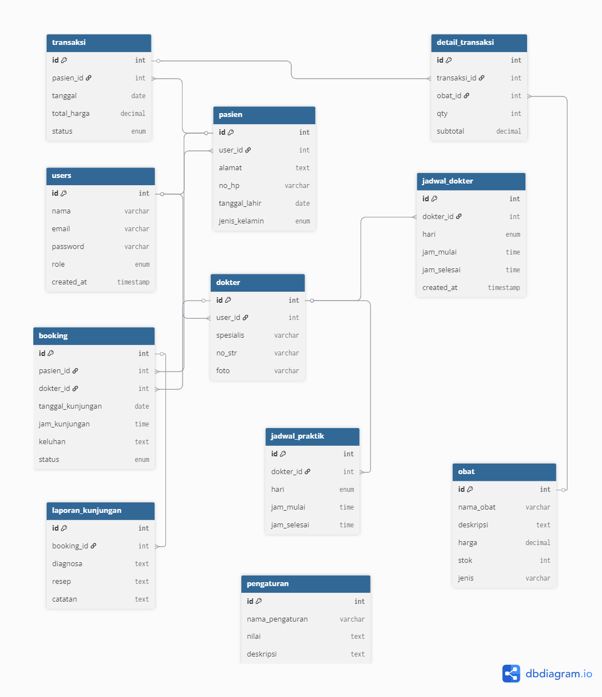

# 🗄️ Database Documentation - Klinik Alma Sehat

**Proyek Ujian Akhir Semester - Pemrograman Web**
**Alma Inna (202312057) - Sekolah Tinggi Teknologi Bontang**
**Email: flowerrdaaisy@gmail.com**

---

## Overview
Klinik Alma Sehat menggunakan database MySQL dengan struktur yang dirancang untuk mendukung aktivitas pengelolaan klinik yang efektif.

## Database Schema

### Tables Structure

#### 1. users
Tabel untuk menyimpan data pengguna klinik.

```sql
CREATE TABLE users (
    id INT PRIMARY KEY AUTO_INCREMENT,
    username VARCHAR(50) NOT NULL UNIQUE,
    email VARCHAR(100) NOT NULL UNIQUE,
    password VARCHAR(255) NOT NULL,
    role ENUM('admin', 'doctor', 'patient') NOT NULL,
    created_at TIMESTAMP DEFAULT CURRENT_TIMESTAMP
);
```

#### 2. doctors
Tabel untuk menyimpan informasi tentang dokter.

```sql
CREATE TABLE doctors (
    id INT PRIMARY KEY AUTO_INCREMENT,
    user_id INT NOT NULL,
    speciality VARCHAR(100) NOT NULL,
    description TEXT,
    FOREIGN KEY (user_id) REFERENCES users(id)
);
```

#### 3. patients
Tabel untuk menyimpan informasi tentang pasien.

```sql
CREATE TABLE patients (
    id INT PRIMARY KEY AUTO_INCREMENT,
    user_id INT NOT NULL,
    medical_record TEXT,
    FOREIGN KEY (user_id) REFERENCES users(id)
);
```

#### 4. schedules
Tabel untuk menyimpan jadwal praktik dokter.

```sql
CREATE TABLE schedules (
    id INT PRIMARY KEY AUTO_INCREMENT,
    doctor_id INT NOT NULL,
    day_of_week ENUM('Monday', 'Tuesday', 'Wednesday', 'Thursday', 'Friday', 'Saturday', 'Sunday') NOT NULL,
    start_time TIME NOT NULL,
    end_time TIME NOT NULL,
    FOREIGN KEY (doctor_id) REFERENCES doctors(id)
);
```

#### 5. bookings
Tabel untuk menyimpan data booking konsultasi.

```sql
CREATE TABLE bookings (
    id INT PRIMARY KEY AUTO_INCREMENT,
    patient_id INT NOT NULL,
    schedule_id INT NOT NULL,
    booking_date DATE NOT NULL,
    status ENUM('confirmed', 'pending', 'canceled') DEFAULT 'pending',
    notes TEXT,
    FOREIGN KEY (patient_id) REFERENCES patients(id),
    FOREIGN KEY (schedule_id) REFERENCES schedules(id)
);
```

#### 6. medicines
Tabel untuk menyimpan informasi tentang obat-obatan.

```sql
CREATE TABLE medicines (
    id INT PRIMARY KEY AUTO_INCREMENT,
    name VARCHAR(100) NOT NULL,
    quantity INT NOT NULL,
    price DECIMAL(10,2) NOT NULL,
    description TEXT
);
```

#### 7. transactions
Tabel untuk menyimpan informasi transaksi penjualan obat.

```sql
CREATE TABLE transactions (
    id INT PRIMARY KEY AUTO_INCREMENT,
    patient_id INT NOT NULL,
    total_amount DECIMAL(10,2) NOT NULL,
    transaction_date DATE NOT NULL,
    payment_status ENUM('paid', 'unpaid') DEFAULT 'unpaid',
    FOREIGN KEY (patient_id) REFERENCES patients(id)
);
```

#### 8. transaction_details
Tabel untuk menyimpan detail item transaksi.

```sql
CREATE TABLE transaction_details (
    transaction_id INT NOT NULL,
    medicine_id INT NOT NULL,
    quantity INT NOT NULL,
    subtotal DECIMAL(10,2) NOT NULL,
    FOREIGN KEY (transaction_id) REFERENCES transactions(id),
    FOREIGN KEY (medicine_id) REFERENCES medicines(id)
);
```

## Entity Relationship Diagram



